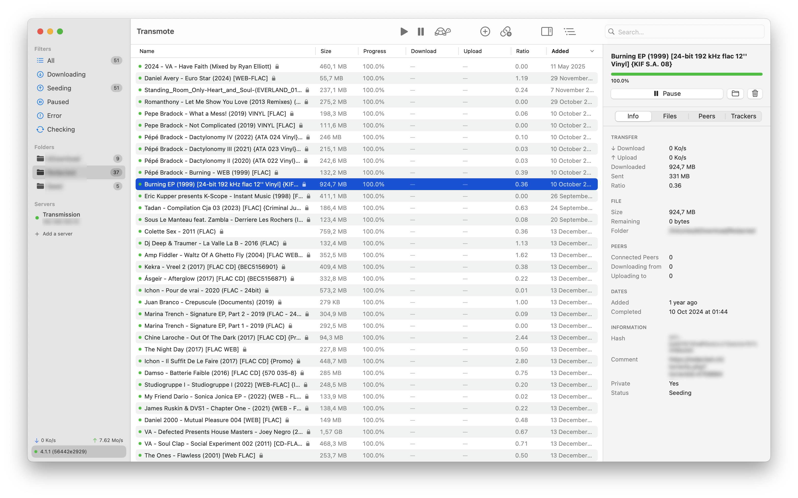

# Transmote

A native macOS remote client for [Transmission](https://transmissionbt.com).




## Download

Grab the latest `.zip` from the [Releases](https://github.com/Kitround/Transmote/releases) page.

**Requires macOS 14.6 (Sonoma) or later.**

> **Note:** Transmote is not code-signed. After opening the `.zip` and moving the app to your Applications folder, macOS may block it. To allow it: **System Settings → Privacy & Security → scroll down → Open Anyway**.

## Features

- Manage multiple Transmission servers
- Start, pause, remove and add torrents (file or magnet link)
- Drag & drop support
- Detail panel with files, peers and trackers
- Menu bar with live speeds
- Turtle mode, bandwidth & queue settings
- Download completion notifications
- Customizable toolbar
- French localization

## Transmission Setup

Enable RPC in Transmission's preferences:

```json
{
  "rpc-enabled": true,
  "rpc-port": 9091
}
```

## License

MIT
