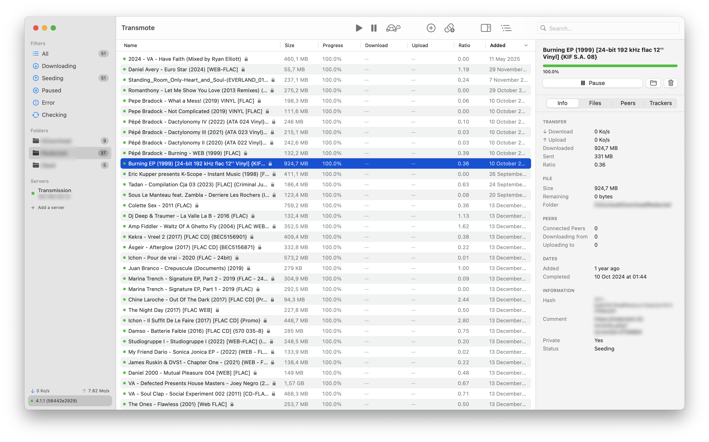

# Transmote

A native macOS remote client for [Transmission](https://transmissionbt.com).




## Download

Latest version: **[v1.8.1](https://github.com/Kitround/Transmote/releases/latest)** — [download `Transmote.zip`](https://github.com/Kitround/Transmote/releases/latest/download/Transmote.zip).

**Requires macOS 14.6 (Sonoma) or later.**

> **Note:** Transmote is not code-signed. After opening the `.zip` and moving the app to your Applications folder, macOS may block it. To allow it: **System Settings → Privacy & Security → scroll down → Open Anyway**.

## Features

- Manage multiple Transmission servers
- Start, pause, remove and add torrents (file or magnet link)
- Drag & drop support
- Detail panel with files, peers and trackers
- Menu bar with live speeds
- Connection loss detection with automatic reconnect
- Turtle mode, bandwidth & queue settings
- Download completion notifications
- Customizable toolbar

## Languages

Transmote is available in:

- English
- French
- German
- Spanish
- Simplified Chinese

It follows your macOS language by default. To pick another one, go to **Settings → General → Language** and restart the app.

## Transmission Setup

Enable RPC in Transmission's preferences:

```json
{
  "rpc-enabled": true,
  "rpc-port": 9091
}
```

## License

MIT
